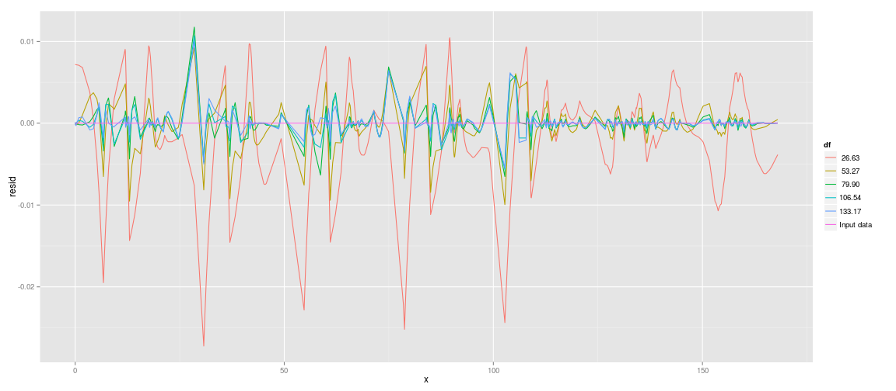

Read input data


```r
rm(list = ls())
dat <- read.table("~/Downloads/DataPoints_TargetFunction_Home.txt")
colnames(dat) <- c("x", "y")
dat <- dat[-543, ]  # delete duplicate observation
```


Count rows


```r
nrow(dat)
```

```
## [1] 734
```


Estimate "ideal" degrees of freedom


```r
(dat.ss <- smooth.spline(dat))
```

```
## Call:
## smooth.spline(x = dat)
## 
## Smoothing Parameter  spar= 0.06506  lambda= 1.187e-10 (15 iterations)
## Equivalent Degrees of Freedom (Df): 133.2
## Penalized Criterion: 0.0005835
## GCV: 1.186e-06
```

```r
dat.ss.df <- dat.ss$df
```


From that, we estimate

splines with the following degrees of freedom:
26.6347, 53.2695, 79.9042, 106.5389, 133.1737
. Estimate and simulate, result is a data frame of the following form:


```r
library(plyr)
dat.sim <- ldply(setNames(dfs, format(dfs)), function(df.in) {
    dat.ss <- smooth.spline(dat, df = df.in)
    data.frame(x = dat$x, y = dat.ss$y, resid = dat.ss$y - dat$y)
}, .id = "df")
head(dat.sim)
```

```
##       df       x      y    resid
## 1  26.63 0.00000 0.6612 0.007205
## 2  26.63 0.02778 0.6615 0.007197
## 3  26.63 0.08333 0.6619 0.007180
## 4  26.63 0.16667 0.6626 0.007155
## 5  26.63 0.19444 0.6629 0.007153
## 6  26.63 0.41667 0.6647 0.007134
```


Append the original data:


```r
dat.full <- rbind(dat.sim, transform(dat, df = "Input data", resid = 0))
```


The fit:


```r
library(ggplot2)
```

```
## Loading required package: methods
```

```r
ggplot(dat.full) + geom_line(aes(x = x, y = y, color = df))
```

 


The residuals:


```r
ggplot(dat.full) + geom_line(aes(x = x, y = resid, color = df))
```

 


